# Download Collection for x264, x265, and AV1 Video Encoding Tools

## Quick-Start Guide for x264, x265, and SVT-AV1 Encoding

**Homepage:** [nazorip.site](https://nazorip.site/archives/1476), **mirror backups:** [Google Drive](https://drive.google.com/drive/folders/1kFCeNGA_wiiLt-DSeI3cyY8vxlffgQcy?usp=sharing), [Baidu Cloud](https://pan.baidu.com/s/1sbz8WztGTz3lcLzirHW_2w)

## Disclaimer and License Notes

This guide is provided for learning and research purposes only. It does not constitute any form of commercial advice or authorization.

1. The software, scripts, and command-line tools mentioned here, including but not limited to FFmpeg, x264/x265, SVT-AV1, QAAC, and VapourSynth, are independently maintained by their respective developers and organizations and are subject to their original license terms.
2. If you use them for commercial or distribution purposes, follow the relevant open-source licenses (such as GPL, BSD, MIT) and the patent laws of your country or region.
3. The author of this document is not responsible for any loss caused by use of the information here; readers should evaluate and assume the associated legal and technical risks themselves.
4. Some audio/video codecs, such as H.264, H.265, and AAC, may still be patent-encumbered in certain regions. For commercial projects, consult the relevant patent pools (for example MPEG LA or Via Licensing) or use royalty-free alternatives such as AV1 or Opus.

---

## Basic Tools

| Tool | Description |
|------|-------------|
| **[mpv player](https://mpv.io/installation/)** | <div style="display: flex; justify-content: center; align-items: center; flex-direction: column;">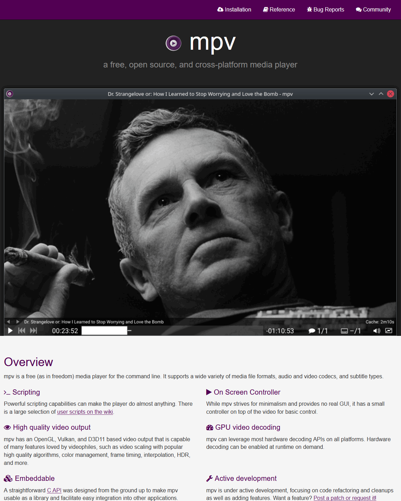</div><br>A modern video player with deep configuration and customization. The downside is that the interface is English-only; Chinese support depends on third-party builds. [Install guide](https://nazorip.site/archives/1052/) |
| **[ffmpeg<br>filters and encoder suite](http://ffmpeg.org/download.html)** | <div style="display: flex; justify-content: center; align-items: center; flex-direction: column;"></div><br>A toolkit for video, audio, and image processing. It provides muxing, demuxing, filters, media processing, and CLI interfaces, and is often the core tool in video workflows. |
| **[Voukoder<br>export plugin for editors](https://www.voukoder.org/)** | <div style="display: flex; justify-content: center; align-items: center; flex-direction: column;">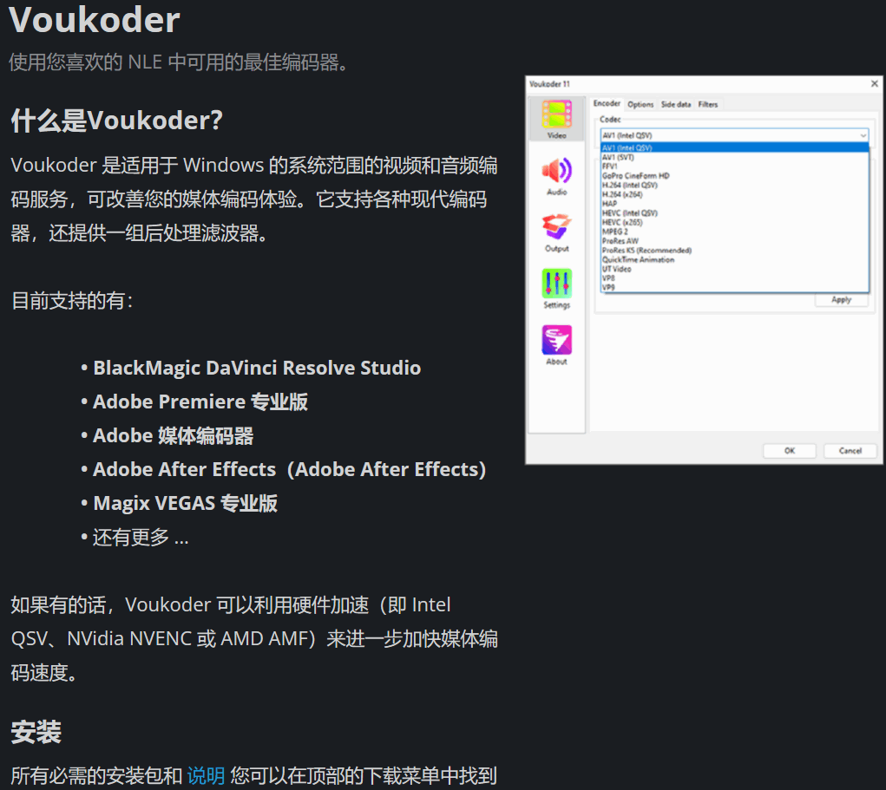</div><br>An open-source export plugin for Premiere, Vegas, and After Effects. |
| **[OBS<br>open-source streaming and recording tool](https://obsproject.com/zh-cn/download)** | <div style="display: flex; justify-content: center; align-items: center; flex-direction: column;">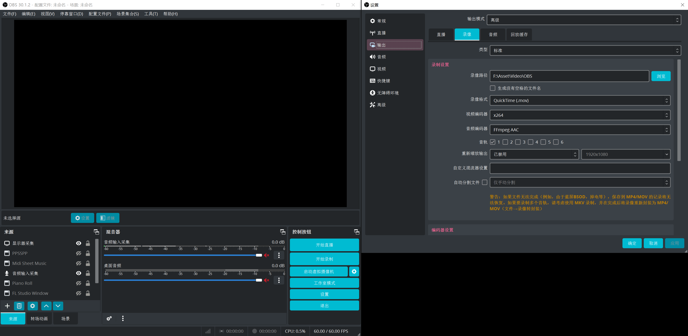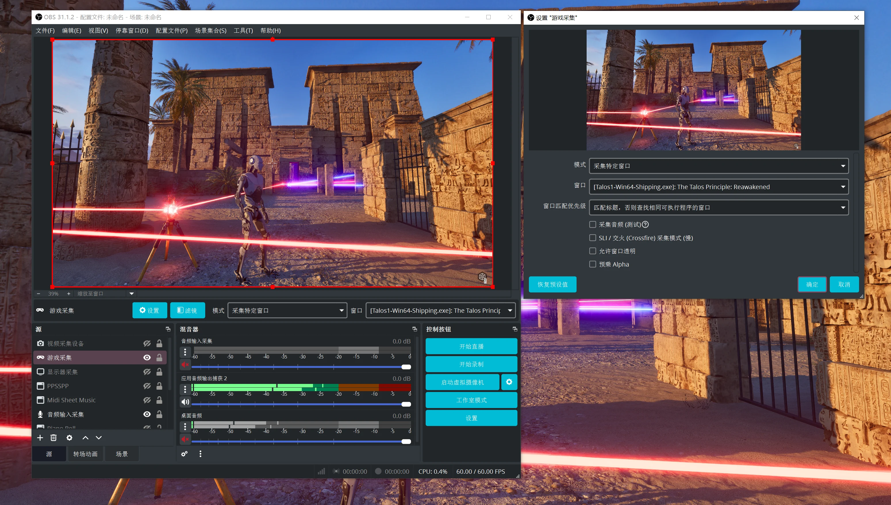</div><br>Useful for recording source material or capturing before/after comparison videos. It supports CLI encoder settings and modern window/audio capture methods, but still takes time to configure. |
| **[MediaInfo<br>metadata reader](https://mediaarea.net/zh-CN/MediaInfo)** | <div style="display: flex; justify-content: center; align-items: center; flex-direction: column;">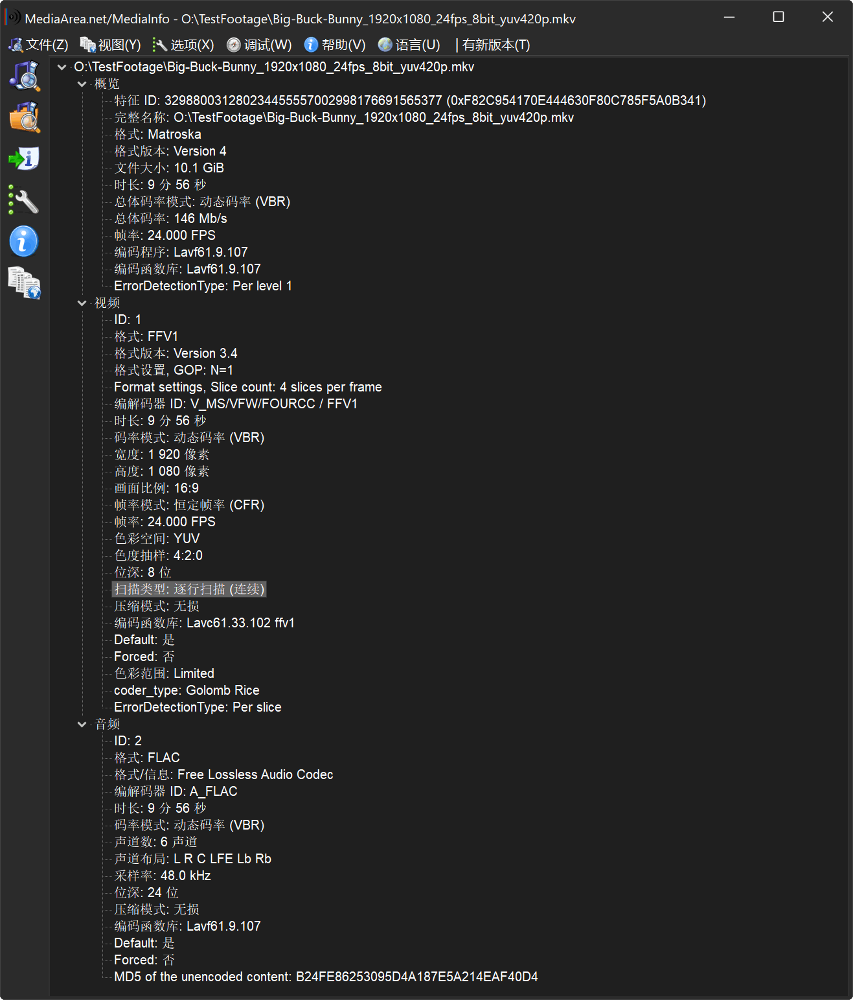</div><br>An open-source media information viewer. Many analysis tools embed it as a component. |
| **[ffprobe<br>media inspection and analysis tool](http://ffmpeg.org/download.html)** | <div style="display: flex; justify-content: center; align-items: center; flex-direction: column;">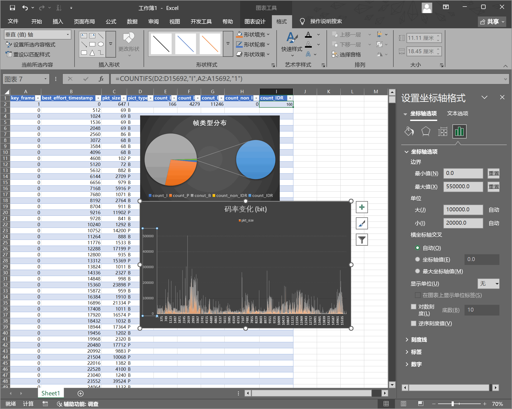</div><br>A CLI metadata extractor that can read normal metadata and also inspect video frames for deeper information.<br>Usually paired with visualization tools such as [Pyzo](https://pyzo.org), Excel, or [Power BI](https://www.microsoft.com/en-us/power-platform/products/power-bi). |
| **[DXVA Checker](https://bluesky-soft.com/en/DXVAChecker.html)** | <div style="display: flex; justify-content: center; align-items: center; flex-direction: column;">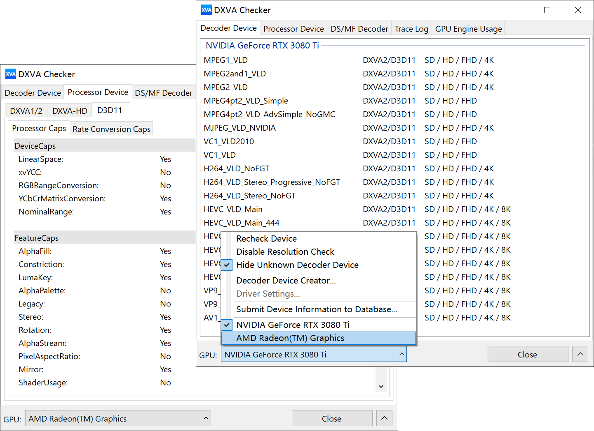</div><br>Checks the hardware decoding and encoding capabilities supported by the PC. |
| **[Process Lasso](https://bitsum.com/)** | <div style="display: flex; justify-content: center; align-items: center; flex-direction: column;">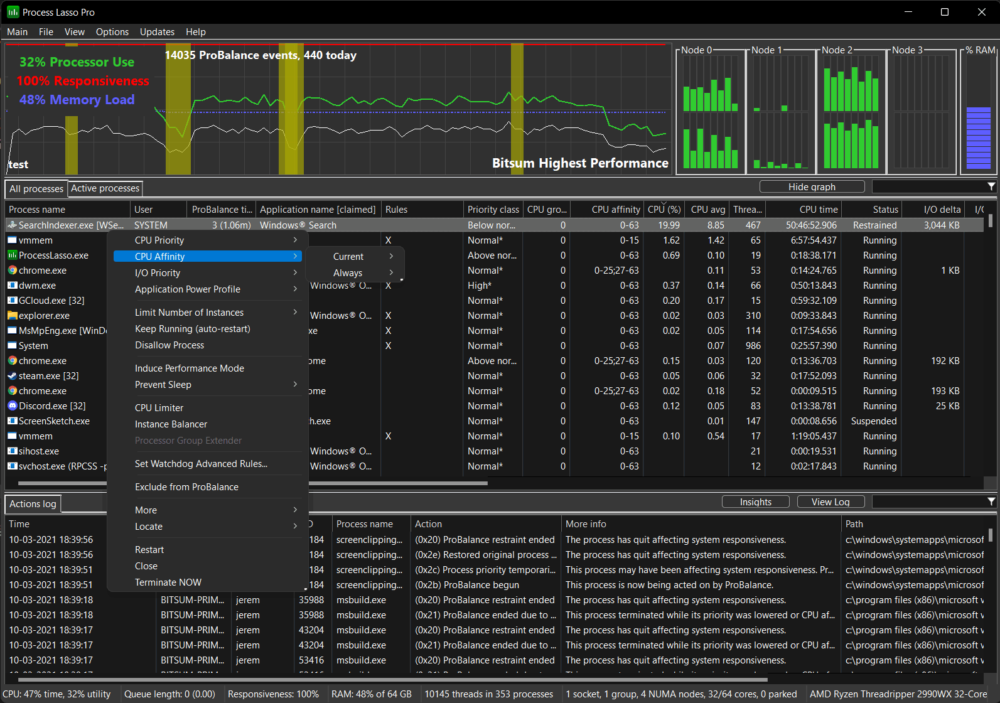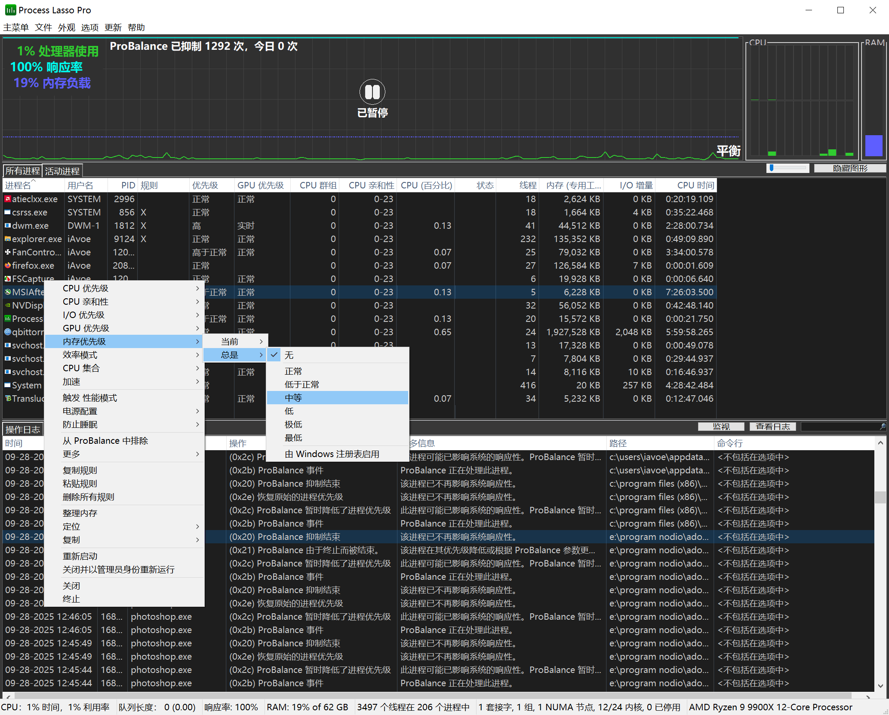</div><br>An automatic process-priority and power-plan optimization tool that helps the system stay responsive when high-load software hangs. |

**Note:** No streaming platform currently offers a clear way to resume a live session. When a game freezes and the system becomes unresponsive, a hard power cycle is the only option. The only workaround is to start a new stream and post a message to the old session to redirect viewers—inconvenient for both streamer and audience. Pro Balance scheduling is not a cure-all, but it can help the system stay more responsive and reduce one common cause of stream interruption. Still, very unstable software or untested hardware can still hang.

## GUI Tools for Calling Encoders

| Tool | Description |
|------|-------------|
| **[ShanaEncoder](https://shana.pe.kr/shanaencoder_download)** | <div style="display: flex; justify-content: center; align-items: center; flex-direction: column;">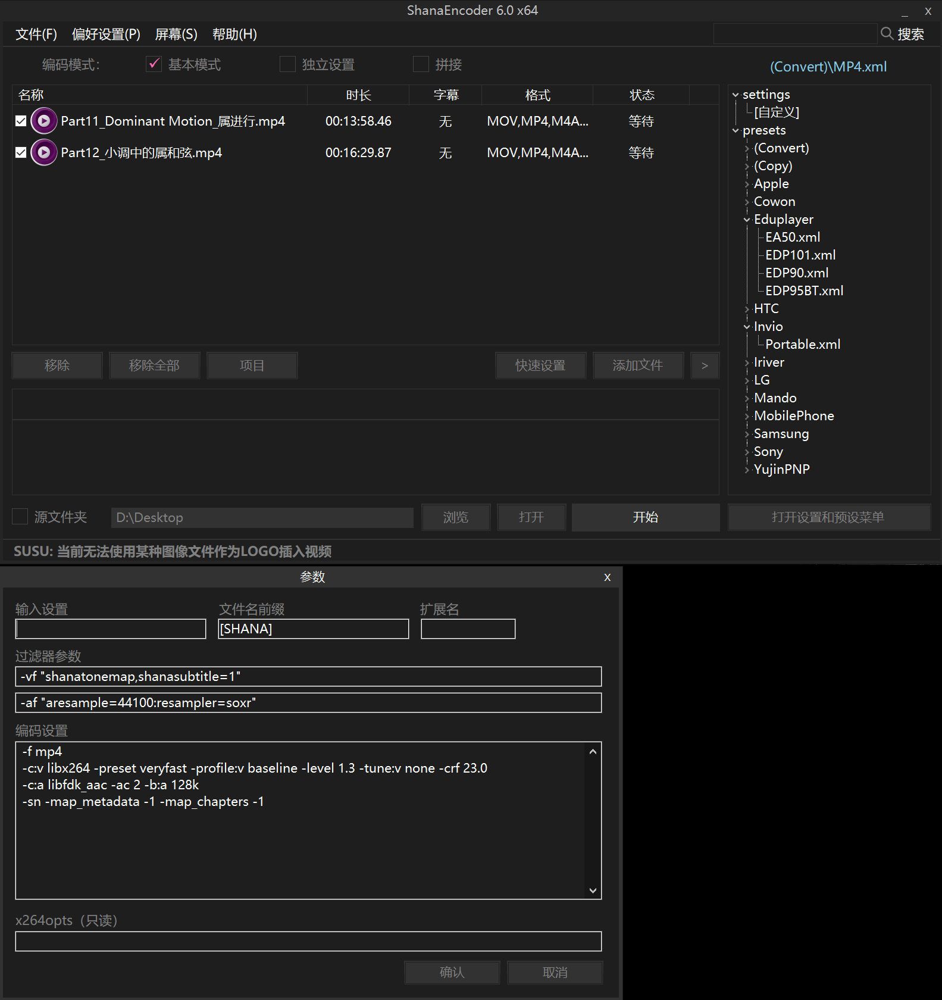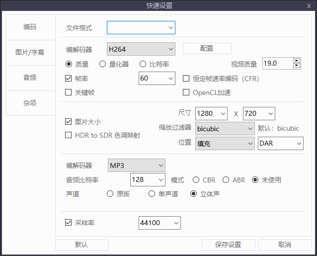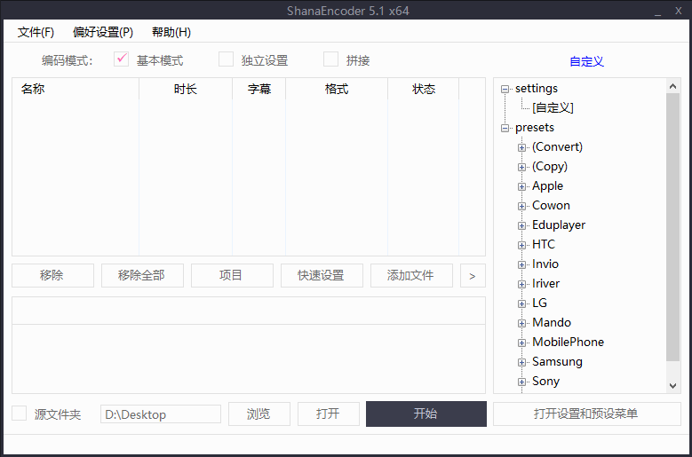</div><br>A mix of ffmpeg CLI and some GUI. It is slower to learn, but uses bundled libx264, libx265, and NVEnc from ffmpeg. |
| **[Simple x264 Launcher](https://bitbucket.org/muldersoft/simple-x264-launcher/downloads/)** | <div style="display: flex; justify-content: center; align-items: center; flex-direction: column;">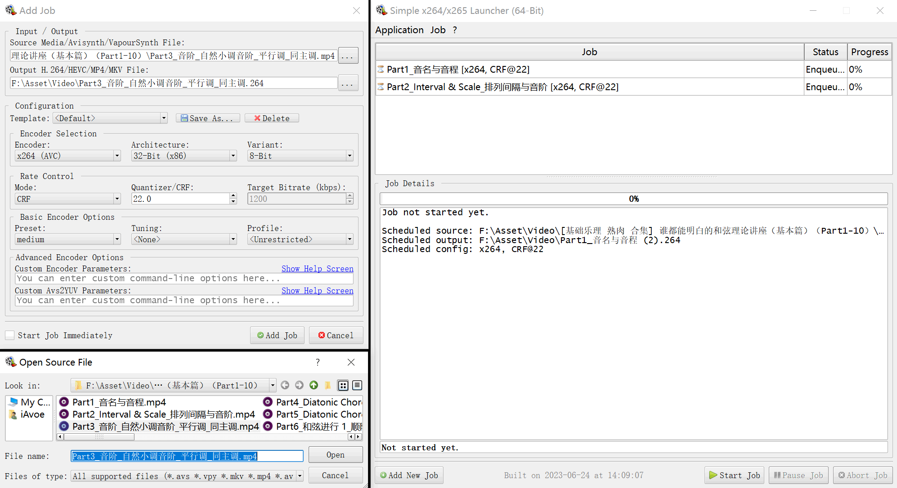</div><br>Includes AviSynth, supports portable VapourSynth, and also works with x265 and NVEnc encoders. Good for batch encoding. |
| **Xiaowan Toolbox<br>mirror: [Baidu Cloud](https://pan.baidu.com/s/1VHonGHoZ0DmQBNZaRjML2A?pwd=crhu) extraction code `crhu`** | <div style="display: flex; justify-content: center; align-items: center; flex-direction: column;">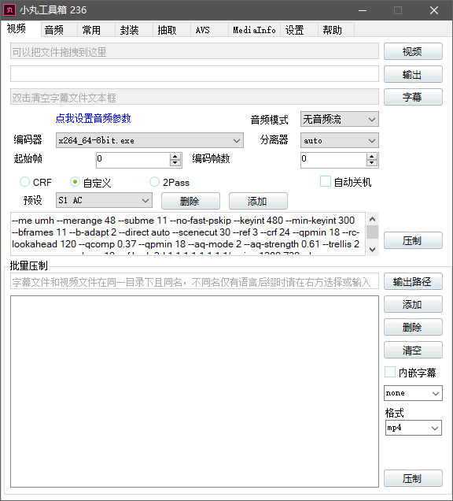</div><br>An easy-to-use Chinese tool suitable for beginners, with built-in MediaInfo, mp4box, and Mkvtoolnix. |

### Other Encoder Launchers

#### PowerShell batch smart encoding tool (bbenc)

An easy-to-use but powerful productivity tool. It automatically generates tailored ffmpeg, vspipe (API-aware), avs2yuv (AviSynth(+) aware), avs2pipemod, and SVFI source configurations, then maps them to x264, x265, and SVT-AV1 encoder parameters based on video specs, user requirements, and hardware. It also includes VS/AVS script generation and complex mux command generation.

- **Homepage:** [NazoRip](https://nazorip.site/archives/1101/)
    - *[GitHub project page](https://github.com/iAvoe/Batch-batch-encoder/tree/main)*
    - *[Questions and feedback](https://github.com/iAvoe/Batch-batch-encoder/issues)*

## Video Quality Benchmark Tools

> See downloads and tutorials for all CLI tools here: [AV1 video encoding tutorial](https://iavoe.github.io/av1-web-tutorial/HTML/index.html#h2-17)

In general, PSNR and SSIM are inaccurate and untrustworthy. For measuring video quality, prefer tools with high Spearman rank correlation (SROCC), high Pearson linear correlation (PLCC), and good performance, such as:
- Objective: block-size-aware weighted PSNR — XPSNR
- Subjective + objective: multi-method fusion — Video Multi-Method Assessment Fusion (VMAF)
- Objective: multi-distortion, multi-resolution structural similarity — SSIMULACRA
- Subjective + objective: psychovisual similarity in XYB space using Euclidean distance — Butteraugli

| Tool | Description |
|------|-------------|
| **[FFMetrics](https://github.com/fifonik/FFMetrics)** | <div style="display: flex; justify-content: center; align-items: center; flex-direction: column;">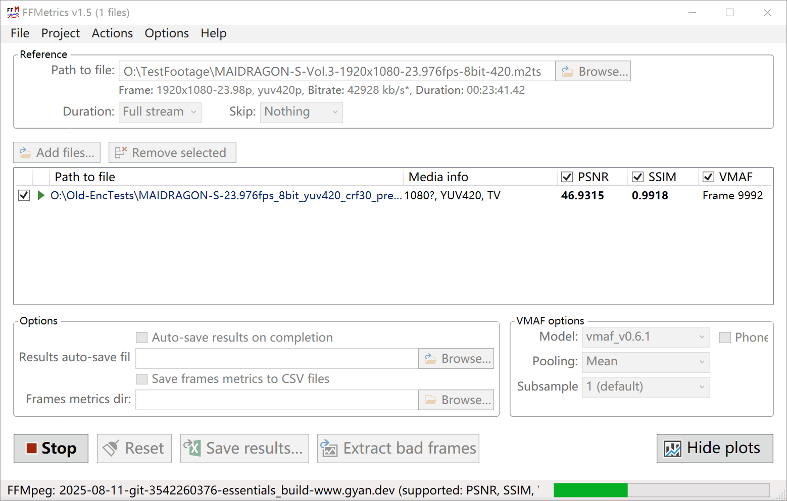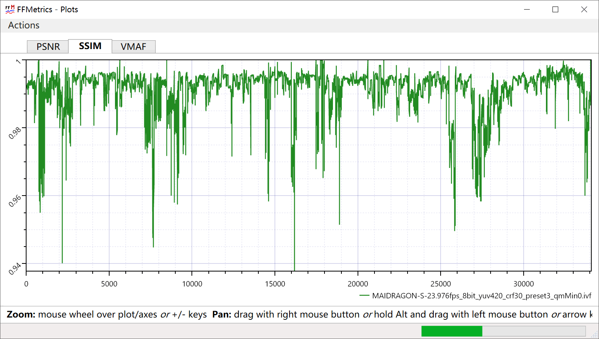</div><br>An open-source GUI for measuring PSNR, SSIM, and VMAF. It supports live charts and concurrent ranking across multiple versions.<br>You must add ffmpeg to the program directory manually, or add ffmpeg to `%PATH%`. |
| **XPSNR (built into ffmpeg)** | Computes the difference between source and compressed output. It is an improved PSNR that focuses on perceptual quality, and requires the source and output time bases to align. |
| **VMAF (built into ffmpeg)** | A subjective quality metric that focuses on perceived visual quality rather than simple difference. It also requires aligned time bases between source and output. |
| **[SSIMULACRA2 VS-HIP](https://github.com/Line-fr/Vship)** | A CLI tool for accurate SSIMULACRA2.1 and Butteraugli quality scoring using NVIDIA and AMD GPUs. Accuracy is still affected by the usual speed-vs-precision tradeoff of GPUs. |
| **[SSIMULACRA2_rs](https://github.com/rust-av/ssimulacra2_bin)** | Uses CPU multithreading to compute SSIMULACRA2.1. It is slower than VS-HIP and requires compilation plus a Python-VapourSynth environment, but it is more accurate. |

> Although FFMetrics limits the importable format range, it calls ffmpeg directly, so you can choose "all files" to select streams in a newly encoded format.

> VMAF's latest models and runner scripts are available from [Netflix/vmaf](https://github.com/Netflix/vmaf), but ffmpeg's built-in version is easier for batch checking multiple videos.

> SSIMULACRA2_rs supports manual multithreading settings, which can significantly improve speed.

### Time Base Alignment Tools

In general, some video quality benchmarks need frame-distance statistics and similar data. For reliable results, the time bases of the source and compressed video must be aligned. Otherwise, the benchmark will be severely distorted and produce worse results. See the full AV1 tutorial and the condensed AV1 tutorial for details.

**GitHub:** [GitHub/GCDLCMCalcualtor](https://github.com/iAvoe/GCDLCMCalculator-VideoQualityMetrics), **mirror backups:** [Google Drive](https://drive.google.com/drive/folders/1kFCeNGA_wiiLt-DSeI3cyY8vxlffgQcy?usp=sharing), [Baidu Cloud](https://pan.baidu.com/s/1sbz8WztGTz3lcLzirHW_2w)

### SSIMULACRA2_rs Download and Build

> Source: [GitHub/rust-av](https://github.com/rust-av/ssimulacra2_bin)

#### 1. Build Environment

1. Download and install rustup: [rustup.rs](https://rustup.rs)
2. Install [VapourSynth](https://github.com/vapoursynth/vapoursynth/releases) in full
  - It **must** be installed in `C:\Program Files\VapourSynth`
  - You **must** choose "Install for all users"
3. Install [Python](https://www.python.org) in full
  - It **must** be run as an administrator
  - In the custom installation, you **must** choose "Install for all users"
  - VapourSynth is tightly bound to the Python version, so do not install a random version
4. Check that `C:\Program Files\VapourSynth\sdk\lib64` exists. If it does not, the above steps were done incorrectly. Uninstall Python and VapourSynth, read carefully, and try again.

#### 2. Download and Build

5. Run `cargo install ssimulacra2_rs` in PowerShell. It should complete without any errors.
6. Copy `C:\Users\username\.cargo\bin\ssimulacra2_rs.exe` to your working path
  - You can uninstall rustup at this point
7. Download the LSMAS decoder: [GitHub/AkarinVS](https://github.com/AkarinVS/L-SMASH-Works/releases)
8. Choose a cache directory variant as needed:
  - official: <code>cachedir=""</code> uses the current command-line working directory; on Windows this defaults to the C drive
  - cwd: <code>cachedir="."</code> uses the command-line path at runtime, i.e. the initial path when CMD/PowerShell/Bash opens
  - tmp: <code>cachedir=%TEMP%</code> uses the system temp directory; on Windows this is usually the C drive
8. Extract and copy `LSMASHSource.dll` and `LSMASHSource.pyd` into the VapourSynth plugin directory:
  - `C:\Program Files\VapourSynth\plugins`

> ssimulacra2_rs cannot print correctly in PowerShell, so use CMD to run it.

> LSMAS cache files are the `O__<video filename>.lwi` index files. They behave like cache files and must be deleted manually after use.

---

## Audio Encoders

To keep this brief, only two high-quality audio encoder options are listed here.

### QAAC

For installation and usage, see the **[QAAC audio encoding tutorial](https://www.nazorip.site/archives/44)** or the **[GitHub mirror](https://github.com/iAvoe/QAAC-Tutorial-Standalone/blob/master/%E6%95%99%E7%A8%8B.md)**. QAAC depends on Apple CoreAudio.

<div style="display: flex; justify-content: center; align-items: center;">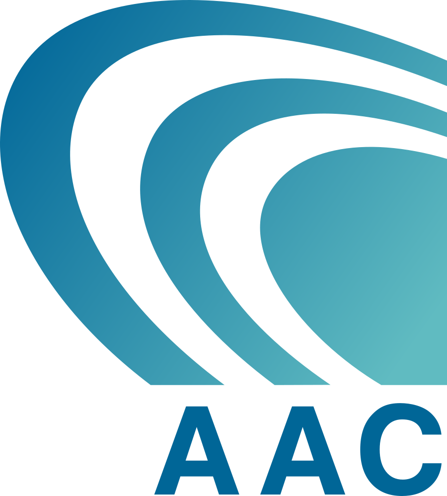</div>

> Image source: [Wikipedia](https://en.wikipedia.org/wiki/File:AAC_original_logo.svg)

### OPUS

<div style="display: flex; justify-content: center; align-items: center;"></div>

> Image source: [OPUS official site](https://opus-codec.org/)

An entirely open, royalty-free, multi-purpose OGG audio codec, usually called directly through ffmpeg. You can also download libopus and follow the documentation on the [OPUS official site](https://opus-codec.org) to use it.

---

## Video Filter Tools

It is recommended to study the tutorial series from the VCB-S encoding group directly: [vcb-s.nmm-hd.org](https://vcb-s.nmm-hd.org/)

| Tool | Description |
|------|-------------|
| **[VapourSynth](https://github.com/vapoursynth/vapoursynth/releases)** | Used to fix frame-level issues in source videos. Different versions are tightly bound to specific Python versions. **Install guide:** [vapoursynth.com](https://www.vapoursynth.com/doc/installation.html) |
| **[AviSynth+](https://github.com/AviSynth/AviSynthPlus/releases)** | A classic video processing tool with multithreading optimizations and high-bit-depth support. It has largely been replaced by VapourSynth, but some filters are still exclusive to it. |
| **[avs2yuv](https://github.com/DJATOM/avs2yuv/releases)** | Pipes AviSynth output to a CLI pipe, much like VSPipe.exe does for VapourSynth. |
| **[avs2pipemod](https://github.com/chikuzen/avs2pipemod/releases)** | Pipes AviSynth output to a CLI pipe, much like VSPipe.exe does for VapourSynth. |

---

## Video Encoders

**lavf (LibavFormat):** the dynamic library responsible for muxing and demuxing.

**FFMS2 (FFmpegSource2):** the dynamic library responsible for decoding, used to provide decoded sources to AviSynth inside x264.

### x264

<div style="display: flex; justify-content: center; align-items: center;"></div>

> Source: [Wikipedia](https://commons.wikimedia.org/wiki/File:X264.png)

| Source | Mux support | Features |
|------|---------|------|
| **[LigH](https://www.mediafire.com/?bxvu1vvld31k1)** | ✅ FFMS2 decode, Lavf muxing | 8-10bit |
| **[jspdr (tMod)](https://github.com/jpsdr/x264/releases/)** | ✅ FFMS2 decode, Lavf muxing | 8-10bit, MCF thread management |
| **x264 7mod<br>[Google Drive](https://drive.google.com/drive/folders/1kFCeNGA_wiiLt-DSeI3cyY8vxlffgQcy?usp=sharing)<br>[Baidu Cloud](https://pan.baidu.com/s/1sbz8WztGTz3lcLzirHW_2w)** | ✅ FFMS2 and Lavf decode/mux | 8-10bit, hqdn3d temporal denoising |
| **[Komisar (KMod)](http://komisar.gin.by/)** | ✅ FFMS2 decode, Lavf muxing | 8, 10bit |

> [8-10-12bit] means one executable supports all three bit depths.

> [8][10][12]bit means three different executable variants.

### Build x264 Yourself

- [Use media-autobuild_suite for automatic builds](https://github.com/m-ab-s/media-autobuild_suite)
  - A comprehensive one-stop build script system for multiple tools.
- [Manual x264 build on Windows (slightly better performance and compression)](.\Compile_x264_Windows.md)
  - The downside is that FFMS2 module integration is not included, but this has little to no practical impact.

---

### x265

<div style="display: flex; justify-content: center; align-items: center;"></div>

> Source: [Wikipedia](https://en.wikipedia.org/wiki/File:X265_%28HEVC_encoder%2C_logo%29.svg)

The fact that the encoder itself lacks additional decoding or muxing/demuxing support is not a defect. Video encoders do not process audio streams, so audio still needs to be muxed after encoding. In addition, newer raw formats such as x265, AV1, and VVC can carry global metadata like frame rate, resolution, and color format, so they can still be previewed in a player even when left unmuxed.

| Source | Encoder audio muxing | Bit depth | Features |
|------|------------|---------|------|
| **[LigH](http://www.mediafire.com/?6lfp2jlygogwa)** | ⛔ raw `.hevc` bitstream | 8-10-12bit | Includes x86 32-bit build and libx265.dll |
| **[jpsdr](https://github.com/jpsdr/x265/releases)** | ⛔ raw `.hevc` bitstream | 8-10-12bit | GCC 12.2 + MSVC_llvm 1928, supports aq-mode 5 |
| **[Rigaya](https://drive.google.com/drive/folders/0BzA4dIFteM2dWEpvWGZXV3ZhdTA)** | ⛔ raw `.hevc` bitstream | 8-10-12bit | GCC 9.3, includes 32-bit build |
| **[Patman](https://github.com/Patman86/x265-Mod-by-Patman/releases)** | ⛔ raw `.hevc` bitstream | 8-10-12bit | GCC 11 + MSVC 1925 |
| **[ShortKatz](https://forum.doom9.org/showthread.php?p=1937773#post1937773)** | ⛔ raw `.hevc` bitstream | 8-10-12bit | For arm64~64e Mac and Android platforms |
| **[DJATOM-aMod](https://github.com/DJATOM/x265-aMod/releases/)** | ⛔ raw `.hevc` bitstream | 10bit, 10-12bit | LLVM-optimized build for Intel and AMD architectures |
| **[MeteorRain-yuuki](https://down.7086.in/)** | ✅ Lavf muxing library | 8, 10, 12bit | GCC 9.3 + ICC 1900 + MSVC 1916 |

> When not using y4m or lavf, specify the `-D` parameter manually.

---

### SVT-AV1

<div style="display: flex; justify-content: center; align-items: center;"></div>

> Source: [Wikipedia](https://commons.wikimedia.org/wiki/File:AV1_logo_2018.svg)

The encoder consists of two files: `SvtAv1Enc.dll` and `SvtAv1EncApp.exe`
- Clang (LLVM) builds optimized for the current CPU architecture usually perform the best, followed by GCC, then MSVC (Visual Studio). The performance gap can be as high as 10% to 50%.

| Source | Encoder audio muxing | Bit depth | Built | Features |
|------|------------|---------|--------|------|
| **[SVT-AV1](https://gitlab.com/AOMediaCodec/SVT-AV1)** | ⛔ `.ivf` light muxing | 8-10bit | ⛔ | Official release |
| **[Gitlab Pipelines](https://gitlab.com/AOMediaCodec/SVT-AV1/-/pipelines)** | ⛔ `.ivf` light muxing | 8-10bit | ✅ | Official CI/CD builds. These are a kind of beta test release, but they do not require compilation. Find the latest passed Daily Run and download the matching system build. |
| **[SVT-AV1-Essential by nekotrix](https://github.com/nekotrix/SVT-AV1-Essential/releases)** | ⛔ `.ivf` `.webm` | 8-10bit | ✅ | Improved default presets and added new parameters such as automatic tile size calculation, CRF zones, high-precision deblocking filter (dlf 2), and fixed thread placeholders. |
| **[SVT-AV1-Essential by Patman86](https://github.com/Patman86/SVT-AV1-Mods-by-Patman/tree/Essential-PMod)** | ⛔ `.ivf` light muxing | 8-10bit | ✅ | Improved default presets and preset 5-2, plus new parameters such as automatic tile size calculation, CRF zones, ultra-high-precision deblocking filter (dlf 3), chroma-specific FGS, and fixed thread placeholders. |
| **[SVT-AV1-HDR by Patman86](https://github.com/Patman86/SVT-AV1-Mods-by-Patman/tree/HDR-PMod)** | ⛔ `.ivf` light muxing | 8-10bit | ✅ | Improved presets with HDR tuning, such as PQ-optimized variance boost curves, film-grain tuning, keyframe-specific TF decay offset values, and more consistent spatial noise distribution. |
| **[SVT-AV1-PSY](https://github.com/psy-ex/svt-av1-psy)** | ⛔ `.ivf` light muxing | 8-10bit | ⛔ | A modified build with extra quality options. Most of its main optimizations have now been merged into the official SVT-AV1, and development has stopped. It is behind the official branch and still requires compilation. |

---

### Option 1 - Manual SVT-AV1 Build on Windows

This method is relatively simple and suitable for beginners.

> Official guide: [Build Guide](https://gitlab.com/AOMediaCodec/SVT-AV1/-/blob/master/Docs/Build-Guide.md)

1. Install **Visual Studio** (2017/2019/2022) and enable the **Desktop development with C++** component.
2. Install **CMake**: [CMake Releases](https://github.com/Kitware/CMake/releases#gh-md-img-large)<br><div style="display: flex; justify-content: center; align-items: center; flex-direction: column;">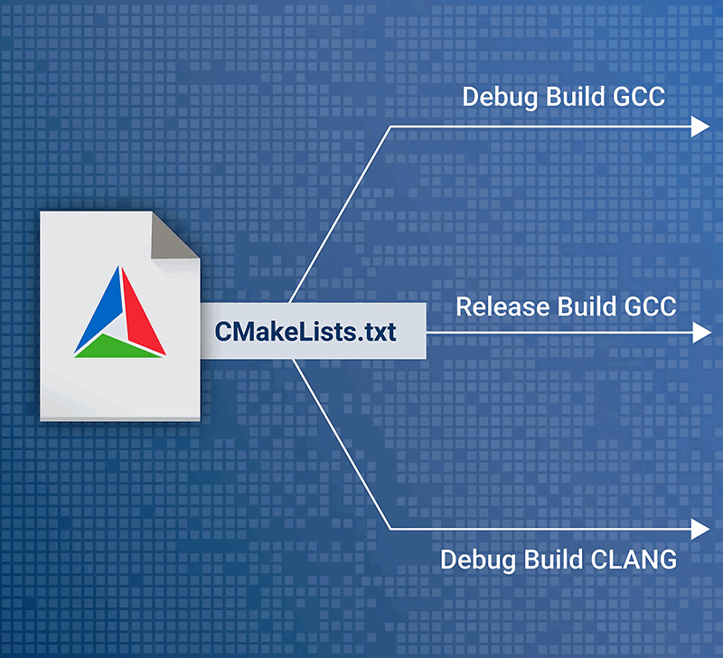</div>
3. Install **NASM**: [NASM official downloads](https://www.nasm.us/pub/nasm/releasebuilds/?C=M;O=D)<br><div style="display: flex; justify-content: center; align-items: center; flex-direction: column;">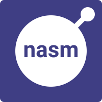</div>
    - In the directory listing, choose the latest build based on your OS and instruction-set width.
        - For example, Windows 64-bit should use the latest `/win64/nasm-***-installer-x64.exe`
    - During install, you can uncheck Manual and VS8 Integration.
4. Download the [SVT-AV1 source code](https://gitlab.com/AOMediaCodec/SVT-AV1/-/archive/master/SVT-AV1-master.zip) and run `Build/windows/build.bat`.
5. The build output is in `Bin\Debug`; once the executable exists, test it with:
```bash
SvtAv1EncApp.exe -v
```
---

### Option 2 - Build SVT-AV1 with Clang (LLVM) (Recommended)

This method is more complex—but still simpler than building x264—and delivers much better performance. It suits users with some programming experience.

> Run all commands in **CMD or (Git) Bash**. Do not use PowerShell.

#### 1. Build Environment

<div style="display: flex; justify-content: center; align-items: center; flex-direction: column;"></div>

1. **LLVM (with clang support):** [LLVM Releases](https://github.com/llvm/llvm-project/releases/latest)
   - In the directory listing, choose the latest build for your OS and instruction-set width.
     - For example, Windows 64-bit users should choose LLVM-***-win64.exe
   - During installation, select Add LLVM to the system PATH for all/current users.
2. **Microsoft C++ Build Tools:** [Microsoft C++ Build Tools](https://visualstudio.microsoft.com/vs/visual-cpp-build-tools)
   - If Visual Studio is already installed and you installed the Desktop development with C++ workload, you can skip this step.
   - Download and run the installer, then choose Desktop development with C++.
   - Open a text editor and note the actual installation path.
   - On the install page, you can choose only MSVC and the latest Windows 10/11 SDK.
3. **CMake** and **NASM**: same as above.
4. Git (optional): git-scm.com/download/win
5. Before building, verify that all tools are installed correctly and output properly from the command line.
```batch
:: Change this if you installed to a different path
"C:\Program Files\LLVM\bin\clang.exe" --version
:: clang version ***
:: Target: x86_64-pc-windows-msvc
:: Thread model: posix
:: InstalledDir: C:\Program Files\LLVM\bin

where clang-cl
:: C:\Program Files\LLVM\bin\clang-cl.exe

nasm --v
:: NASM version *** compiled on *** *** ***
cmake --version
:: cmake version ***
:: CMake suite maintained and supported by Kitware (kitware.com/cmake)
```

#### 2. Download the Project Source

##### a. Browser Download

Download the GitLab/AOMediaCodec/SVT-AV1 project as a [ZIP archive](https://gitlab.com/AOMediaCodec/SVT-AV1/-/archive/master/SVT-AV1-master.zip) and extract it.

##### b. Git Download

If you installed Git as above, open Git Bash and run:

1. Move to the download path. Path formats differ by shell.
  - `cd <download path>`
  - Example: to download to the D drive desktop: `cd /d/Desktop/`
2. Download SVT-AV1
  - `git clone https://gitlab.com/AOMediaCodec/SVT-AV1.git`
  - `cd svt-av1`

#### 3. Build the Project

**Full command list for reference only; it cannot be run all at once**
```batch
chcp 65001
call "C:\Program Files (x86)\Microsoft Visual Studio\2022\BuildTools\VC\Auxiliary\Build\vcvars64.bat"
set "CC=clang-cl"
set "CXX=clang-cl"

cmake --fresh -B svt_build -G Ninja ^
-DCMAKE_BUILD_TYPE=Release ^
-DBUILD_SHARED_LIBS=OFF ^
-DCMAKE_CXX_FLAGS_RELEASE="-flto /DNDEBUG /clang:-O2 -march=native"
```

1. Switch the console encoding to UTF-8:
```batch
chcp 65001
```
2. Run the vcvars64.bat environment script from the previously installed VS Build Tools path (adjust for your install location):
```batch
call "C:\Program Files (x86)\Microsoft Visual Studio\2022\BuildTools\VC\Auxiliary\Build\vcvars64.bat"
```
> If you already have a 64-bit Visual Studio with the Desktop development with C++ workload, the path may be:

> `C:\Program Files\Microsoft Visual Studio\2022\Community\VC\Auxiliary\Build\vcvars64.bat`

<div style="display: flex; justify-content: center; align-items: center; flex-direction: column;">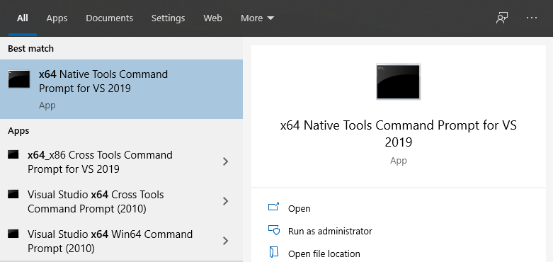</div>

> Figure: x64 Native Tools Command Prompt for VS 20xx

3. After running vcvars64.bat, a new CMD window opens. Set the two variables below to use the Clang-CL compiler:
```batch
set "CC=clang-cl"
set "CXX=clang-cl"
```
4. Use CMake to generate a Ninja project and configure the build options (adjust according to the CPU architecture of the encoding machine):
  - If you are not already in the SVT-AV1 or SVT-AV1-PSY directory, use `cd` to move there.
  - If the CPU supports AVX-512 and is newer than ZEN 2, `-DENABLE_AVX512=ON` is recommended.
```batch
:: Line continuation depends on the shell; CMD uses `^`, Bash uses `\`
:: To build Debug instead of Release, remove the whole `-DCMAKE_BUILD_TYPE=Release` line
cmake --fresh -B svt_build -G Ninja ^
-DCMAKE_BUILD_TYPE=Release ^
-DBUILD_SHARED_LIBS=OFF ^
-DENABLE_AVX512=OFF ^
-DSVT_AV1_LTO=OFF ^
-DCMAKE_CXX_FLAGS_RELEASE="-flto /DNDEBUG /clang:-O2 -march=native" ^
-DCMAKE_C_FLAGS_RELEASE="-flto /DNDEBUG /clang:-O2 -march=native"
```
5. Finally, build with Ninja. If you do not use `-DCMAKE_BUILD_TYPE=Release`, the output will go to `Bin\Debug`:
```batch
ninja -C svt_build
:: *** warnings generated.
:: D[242/242] Linking C executable *:\***\SVT-AV1-master\Bin\Release\SvtAv1EncApp.exe
```

---

## Official Open-Source Encoder Projects

These projects are mainly useful for:
- Downloading, inspecting, modifying, and compiling source code
- Checking commit history and update notes
- Reporting encoder issues to developers

| Video encoder project | Description |
| --------------------- | ------------ |
| **[x264 – VideoLAN](https://code.videolan.org/videolan/x264)** | H.264/AVC encoder maintained by the VideoLAN team, widely used in FFmpeg, OBS, and others. |
| **[x265 – MulticoreWare](https://bitbucket.org/multicoreware/x265_git/src/master)** | Main Open-source repository of the H.265/HEVC encoder  |
| **[x265 – GitHub/MulticoreWare](https://github.com/Multicorewareinc/x265)**         | Main Open-source repository of the H.265/HEVC encoder (New) |
| **[SVT-AV1 – AOMedia](https://gitlab.com/AOMediaCodec/SVT-AV1)** | A high-performance AV1 encoder maintained by Intel and part of the official AOMedia SVT family. |
| **[libaom – AOMedia](https://aomedia.googlesource.com/aom/)** | AOMedia's official reference AV1 encoder implementation, quality first. |
| **[rav1e – Xiph / Mozilla](https://github.com/xiph/rav1e)** | An AV1 encoder written in Rust, focused on safety and speed. |
| **[vpx – WebM / Google](https://chromium.googlesource.com/webm/libvpx/)** | Google's official implementation of VP8/VP9. |
| **[SVT-HEVC – Intel](https://github.com/OpenVisualCloud/SVT-HEVC)** | Intel's high-performance HEVC encoder for server/cloud transcoding. |
| **[SVT-VP9 – Intel](https://github.com/OpenVisualCloud/SVT-VP9)** | Intel's VP9 encoder implementation. |
| **[openh264 – Cisco](https://github.com/cisco/openh264)** | Cisco's open-source H.264 encoder, lightweight and widely used for real-time communication. |
| **[Theora – Xiph.Org](https://gitlab.xiph.org/xiph/theora)** | An open video coding standard based on VP3. |
| **[FFmpeg – FFmpeg.org](https://github.com/FFmpeg/FFmpeg)** | Not a standalone encoder, but integrates many encoders such as x264, x265, libaom, and SVT. |
| **[Daala – Xiph.Org](https://gitlab.xiph.org/xiph/daala)** | Xiph's experimental next-generation video encoder, which provided technical foundations for AV1. |
| **[VVenC – Fraunhofer HHI](https://github.com/fraunhoferhhi/vvenc)** | Fraunhofer HHI's open-source VVC (H.266) encoder. |
| **[VVC Test Model (VTM)](https://vcgit.hhi.fraunhofer.de/jvet/VVCSoftware_VTM)** | JVET's official VVC/H.266 reference software implementation. |

| Audio encoder project | Description |
| --------------------- | ------------ |
| **[QAAC – nu774](https://github.com/nu774/qaac)** | Probably the best AAC audio encoder, based on Apple CoreAudio (Windows requires iTunes DLLs). |
| **[Opus – Xiph / Mozilla / Skype](https://gitlab.xiph.org/xiph/opus)** | An IETF-standardized low-latency audio encoder for speech and music. |
| **[libopusenc – Xiph.Org](https://gitlab.xiph.org/xiph/libopusenc)** | A small library that wraps the Opus encoding API for recording or live streaming. |
| **[FDK-AAC – Fraunhofer IIS](https://github.com/mstorsjo/fdk-aac)** | Fraunhofer's open-source AAC encoder with high-quality LC/HE/HEv2 modes. |
| **[LAME – HydrogenAudio](https://lame.sourceforge.io/)** | The well-known open-source MP3 encoder. |
| **[FLAC – Xiph.Org](https://gitlab.xiph.org/xiph/flac)** | The official implementation of the FLAC lossless audio format. |
| **[Vorbis – Xiph.Org](https://gitlab.xiph.org/xiph/vorbis)** | Xiph.Org's lossy audio encoder, an open-source alternative to MP3. |
| **[Musepack (MPC)](https://github.com/MusepackProject/musepack)** | An audio encoder focused on transparent quality at higher bitrates. |
| **[WavPack](https://github.com/dbry/WavPack)** | A hybrid lossless/lossy audio encoder. |
| **[ALAC – Apple](https://github.com/macosforge/alac)** | The open-source implementation of Apple's lossless audio codec (ALAC). |
| **[TTA – True Audio](http://true-audio.com/)** | The official implementation of the TTA lossless audio format. |
| **[Monkey's Audio (APE)](https://github.com/monkeysaudio/Monkey-Audio)** | A high-compression lossless audio encoder. |
| **[Shorten – SoftSound](https://github.com/robdobsn/shorten)** | An early lossless audio format and one of FLAC's predecessors. |

---

## References

The original tutorial for SVT-AV1 Clang/LLVM builds is on the AV1 Weeb Edition Discord in the `#scripts-tools-and-guides` channel. This document localizes it by adjusting commands such as `set`, adding `chcp`, and expanding the instructions with extra notes and checks for LLVM, NASM, and CMake.
