# x264 x265 AV1 视频压制相关工具下载合集 

## 急用版 x264、x265、SVT-AV1 压制教程

**首页：**[nazorip.site](https://nazorip.site/archives/1476)、**镜像备份：**[谷歌盘](https://drive.google.com/drive/folders/1kFCeNGA_wiiLt-DSeI3cyY8vxlffgQcy?usp=sharing)、[百度云](https://pan.baidu.com/s/1sbz8WztGTz3lcLzirHW_2w)

## 免责声明与许可声明

本教程仅用于学习与研究目的，不构成任何形式的商业使用建议或授权。

1. 本教程所提及的软件、脚本及命令行工具（包括但不限于 FFmpeg、x264/x265、SVT-AV1、QAAC、VapourSynth 等）均由其各自的开发者和组织独立维护，并受其原始许可证条款约束
2. 若用于商业或分发用途，请遵守相关的开源许可（如 GPL、BSD、MIT 等）以及各国/地区的专利法规
2. 本文档作者不对因使用本文所述内容造成的任何直接或间接损失承担责任
4. 读者应自行评估并承担相应的法律与技术风险
5. 某些音视频编解码器（如 H.264、H.265、AAC）在部分地区仍受专利保护。商用项目请咨询相关专利池（如 MPEG LA、Via Licensing）或使用免专利方案（如 AV1、Opus）

---

## 基本工具

| 工具 | 简介 |
|------|------|
| **[mpv 播放器](https://mpv.io/installation/)** | <div style="display: flex; justify-content: center; align-items: center; flex-direction: column;">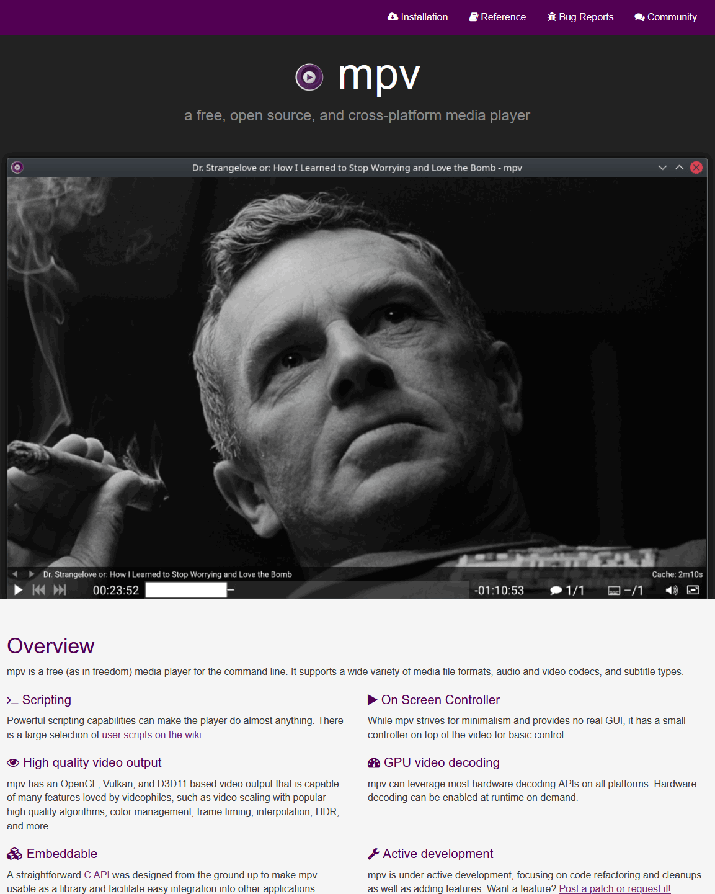</div><br>现代视频播放器，支持深度配置、定制，缺点是界面仅英语，中文支持要看第三方修改版。[安装教程](https://nazorip.site/archives/1052/) |
| **[ffmpeg<br>滤镜工具与编码器](http://ffmpeg.org/download.html)** | <div style="display: flex; justify-content: center; align-items: center; flex-direction: column;"></div><br>视频、音频、图像处理的工具集，提供封装、解封装、滤镜、音视频处理与命令行调用接口，常被作为视频处理的核心工具 |
| **[Voukoder<br>剪辑软件导出插件](https://www.voukoder.org/)** | <div style="display: flex; justify-content: center; align-items: center; flex-direction: column;">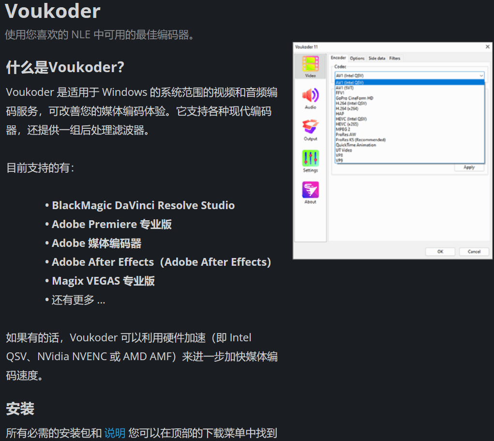</div><br>Premiere/Vegas/AE 开源导出插件。 |
| **[OBS<br>开源直播与录制工具](https://obsproject.com/zh-cn/download)** | <div style="display: flex; justify-content: center; align-items: center; flex-direction: column;">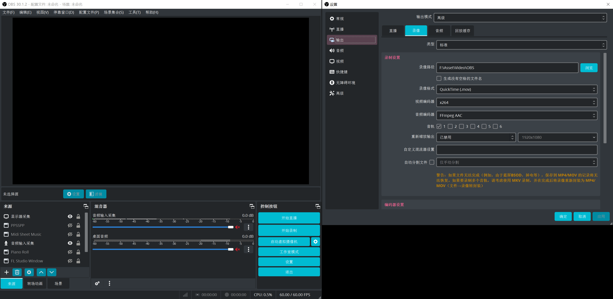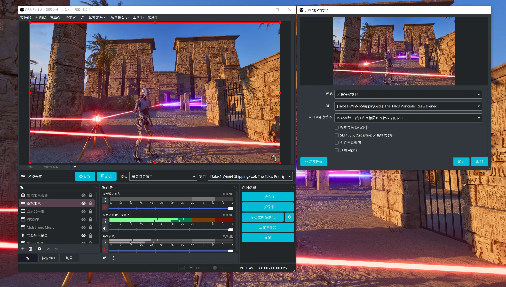</div><br>适合录制原素材或采集压制前后对比视频，支持命令行设定编码器，现代窗口和音频捕获方法，但也需要花时间配置。 |
| **[MediaInfo<br>元数据读取工具](https://mediaarea.net/zh-CN/MediaInfo)** | <div style="display: flex; justify-content: center; align-items: center; flex-direction: column;">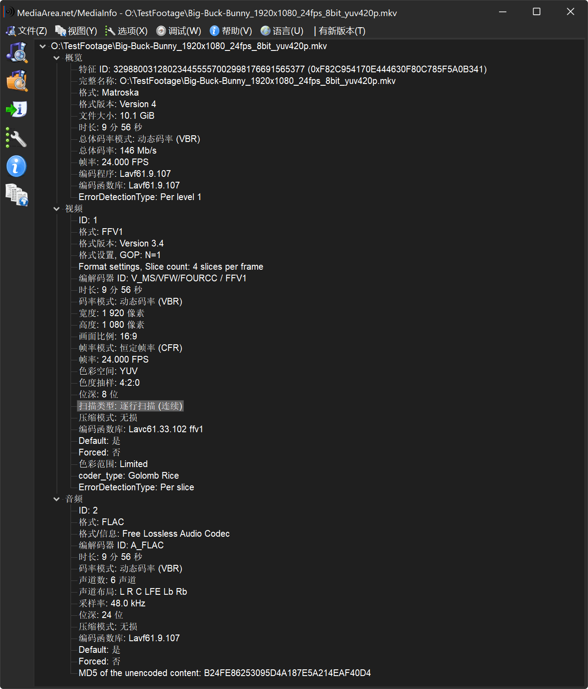</div><br>开源媒体信息查看器。 |
| **[ffprobe<br>视音频读取与分析工具](http://ffmpeg.org/download.html)** | <div style="display: flex; justify-content: center; align-items: center; flex-direction: column;">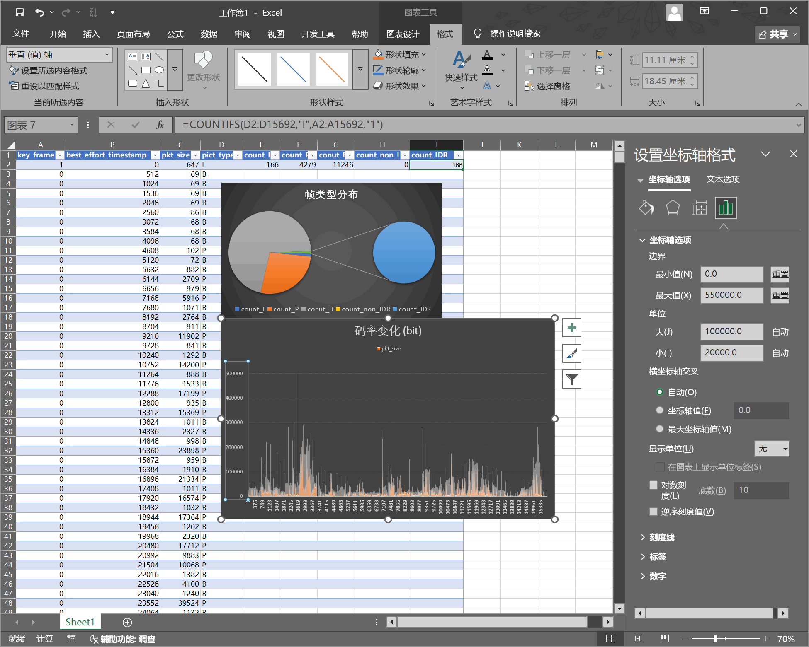</div><br>CLI 媒体元数据分析工具。[Excel 可视化教程](https://nazorip.site/archives/1068/) |
| **[DXVA Checker](https://bluesky-soft.com/en/DXVAChecker.html)** | <div style="display: flex; justify-content: center; align-items: center; flex-direction: column;">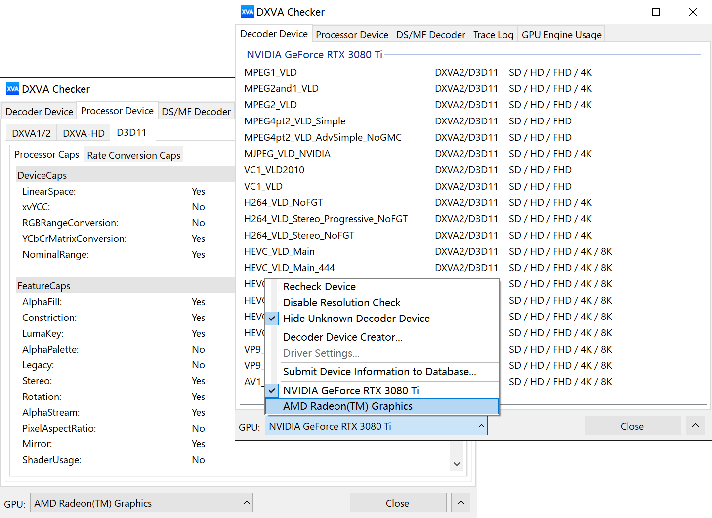</div><br>检测 PC 支持的硬件编解码能力 |
| **[Process Lasso](https://bitsum.com/)** | <div style="display: flex; justify-content: center; align-items: center; flex-direction: column;">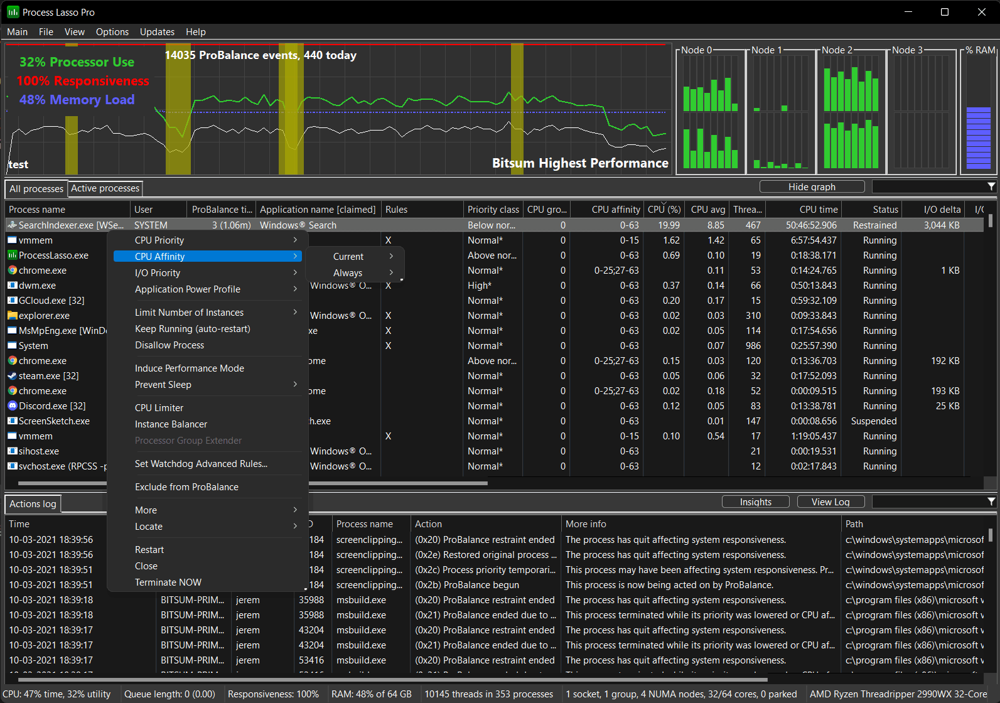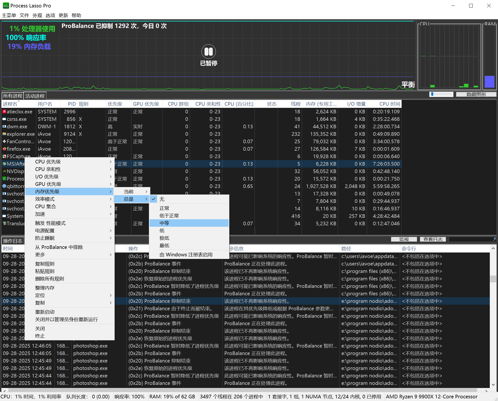</div><br>自动优化进程优先级与电源计划工具，保证高占用软件卡死时系统正常响应 |

**注**：目前没有直播平台明确支持恢复直播会话的能力。因此当大型游戏卡死，系统不响应，只能断电重启时，唯一的选择是创建新直播，然后向旧会​​话发送消息以通知观众跳转（对主播和观众来说都很麻烦）。虽然 Pro Balance 调度不包治百病，但它在一定程度上保证了系统更容易响应用户操作，也减少了直播中断的一种可能。但对于非常不稳定的程序或没有通过烤机检测硬件稳定性的工况来说还是会卡死。

## 调用编码器的 GUI 工具

| 工具 | 简介 |
|------|------|
| **[ShanaEncoder](https://shana.pe.kr/shanaencoder_download)** | <div style="display: flex; justify-content: center; align-items: center; flex-direction: column;">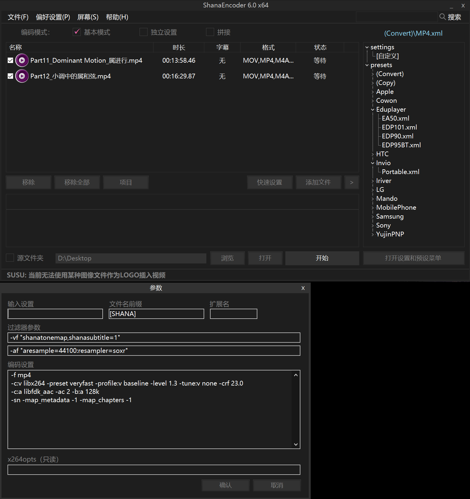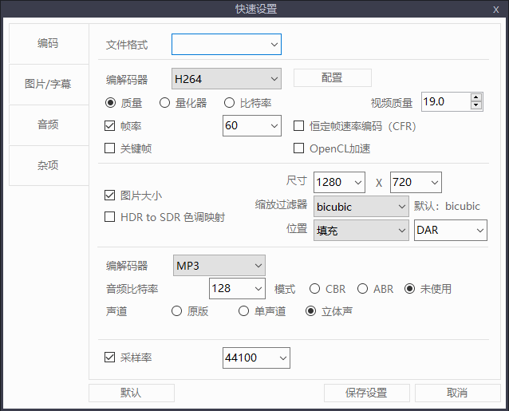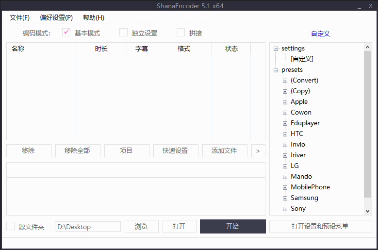</div><br>ffmpeg-CLI 搭配部分 GUI，上手较慢。使用了 ffmpeg 内嵌的 libx264、libx265、NVEnc。 |
| **[Simple x264 Launcher](https://bitbucket.org/muldersoft/simple-x264-launcher/downloads/)** | <div style="display: flex; justify-content: center; align-items: center; flex-direction: column;">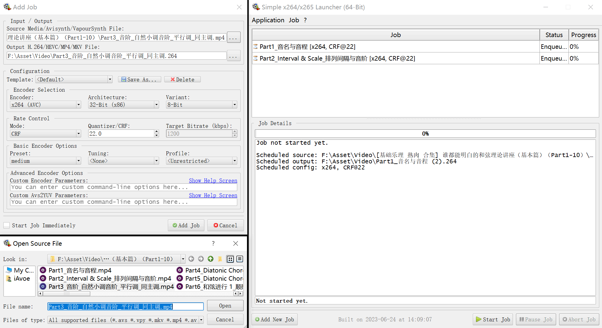</div><br>内嵌 AviSynth，支持便携版 VapourSynth，额外支持 x265 和 NVEnc 编码器，适合批量压制。 |
| **小丸工具箱<br>镜像：[百度云](https://pan.baidu.com/s/1VHonGHoZ0DmQBNZaRjML2A?pwd=crhu) 提取码 `crhu`** | <div style="display: flex; justify-content: center; align-items: center; flex-direction: column;">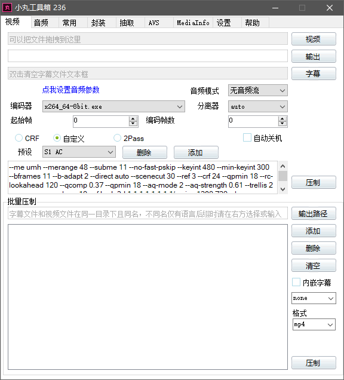</div><br>操作简单、适合入门的中文软件，内嵌 MediaInfo、mp4box、Mkvtoolnix。 |

## 视频画质跑分工具

> 所有命令行工具的下载与教程见：[AV1 视频压制教程](https://iavoe.github.io/av1-web-tutorial/HTML/index.html#h2-17)

总的来说，PSNR、SSIM 不准确，不可信；测量视频画质应该选择 Spearman 单调相关系数（SROCC）和 Pearson 线性相关系数（PLCC）高，并且性能可观的画质跑分工具，如：
- 客观：块大小感知加权峰值信噪比——XPSNR
- 主观+客观：多方法融合——Video multi-method assessment fusion（VMAF）
- 客观：多失真识别多分辨率结构相似性——SSIMULACRA
- 主观+客观：XYB 空间欧几里得距离心理视觉相似性——Butteraugli

| 工具 | 简介 |
|------|------|
| **[FFMetrics](https://github.com/fifonik/FFMetrics)**            | <div style="display: flex; justify-content: center; align-items: center; flex-direction: column;">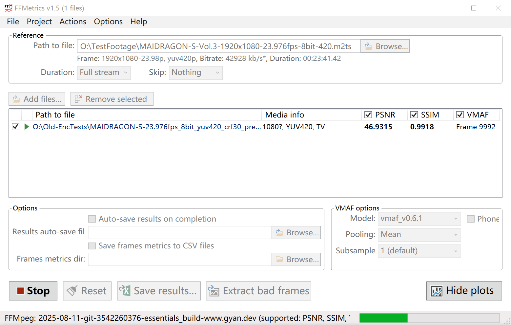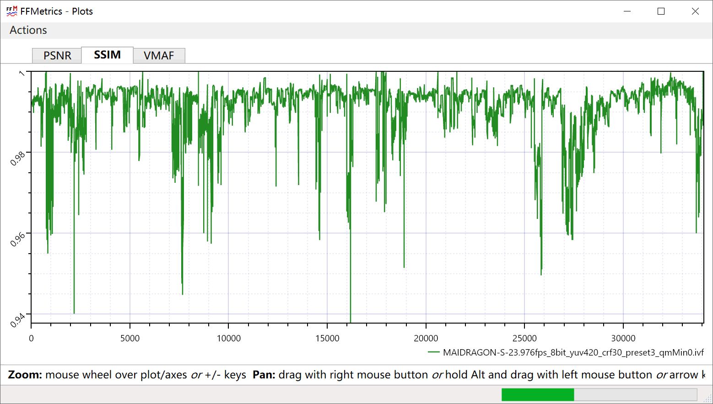</div><br>测量 PSNR、SSIM、VMAF 的开源 GUI 软件，支持实时图表显示和多版本并行排名。<br>需手动添加 ffmpeg 到程序目录（或添加 ffmpeg 到 `%PATH%`） |
| **XPSNR（ffmpeg 内置）**                                          | 计算“源与压缩结果的差异”，注重暂停画质的深度改进版 PSNR，需要源视频与压缩结果的时间基对齐 |
| **VMAF（ffmpeg 内置）**                                           | 主观画质指标跑分，倾向于检查视觉观感体验，而非简单地差异（如高压缩下保证大体观感），需要源视频与压缩结果的时间基对齐 |
| **[SSIMULACRA2 VS-HIP](https://github.com/Line-fr/Vship)**       | 使用英伟达和 AMD 显卡计算 SSIMULACRA2.1、Butteraugli 的准确视频画质跑分命令行工具，准确度同样受到显卡快但精度低的影响 |
| **[SSIMULACRA2_rs](https://github.com/rust-av/ssimulacra2_bin)** | 使用 CPU 多线程计算 SSIMULACRA2.1，比 VS-HIP 的更慢，且需要编译、需要 Python-VapourSynth 环境，优点是精度更高（由于和画质相关，因此得分也更高） |

> 尽管 FFMetrics 在导入文件时限制了格式范围，但它直接调用了 ffmpeg，因此可以选择“所有文件”来选中新编码格式的视频流

> VMAF 可在 [Netflix/vmaf](https://github.com/Netflix/vmaf) 获取最新版模型与运行脚本，但 ffmpeg 内置版本更容易实现多视频批量检测

> SSIMULACRA2_rs 支持手动指定多线程参数，从而显著提高速度

### 时间基对齐工具

总的来说，由于部分视频画质跑分需要统计帧间距离等数据，因此源与压缩视频的时间基（Time base）需要对齐，否则跑分会严重失真（变差）。详见 AV1 教程完整版、 AV1 教程精简版。

**GitHub：**[GitHub/GCDLCMCalcualtor](https://github.com/iAvoe/GCDLCMCalculator-VideoQualityMetrics)、**镜像备份：**[谷歌盘](https://drive.google.com/drive/folders/1kFCeNGA_wiiLt-DSeI3cyY8vxlffgQcy?usp=sharing)、[百度云](https://pan.baidu.com/s/1sbz8WztGTz3lcLzirHW_2w)

### SSIMULACRA2_rs 下载与编译

> 来源：[GitHub/rust-av](https://github.com/rust-av/ssimulacra2_bin)

#### 一. 编译环境

1. 下载并安装 rustup：[rustup.rs](https://rustup.rs)
2. **完整安装** [VapourSynth](https://github.com/vapoursynth/vapoursynth/releases)
  - **必须**安装到 `C:\Program Files\VapourSynth`
  - **必须**选择“Install for all users”
3. **完整安装** [Python](https://www.python.org)
  - **必须**以管理员身份运行
  - **必须**在自定义安装中选择“Install for all users”
  - VapourSynth 的版本与 Python 版本强绑定，不能随意安装版本
4. 检查 `C:\Program Files\VapourSynth\sdk\lib64` 路径存在，若不存在则上述步骤执行有误，需卸载 Python 和 VapourSynth，仔细阅读并重试

#### 二. 下载与编译

5. PowerShell 中运行 `cargo install ssimulacra2_rs`完成安装，过程中不应该有任何报错
6. 将 `C:\Users\用户名\.cargo\bin\ssimulacra2_rs.exe` 拷贝到工作路径
  - 此时可以卸载 rustup
7. 下载 LSMAS 解码器：[GitHub/AkarinVS](https://github.com/AkarinVS/L-SMASH-Works/releases)
8. 随意根据想要的缓存文件路径位置设定选择版本：
  - 官方：<code>cachedir=""</code>，命令行窗口当前路径，Windows 默认为 C 盘
  - cwd：<code>cachedir="."</code>，即运行时的命令行路径，即打开 CMD/PowerShell/Bash 时的初始路径
  - tmp：<code>cachedir=%TEMP%</code>，据操作系统设置指定缓存盘，Windows 一般为 C 盘
8. 解压并拷贝下载的 `LSMASHSource.dll`、`LSMASHSource.pyd` 到 VapourSynth 插件目录下：
  - `C:\Program Files\VapourSynth\plugins`

> ssimulacra2_rs 在 PowerShell 中无法正常打印信息，需要使用 CMD 运行

> LSMAS 缓存文件代表“O__&lt;视频文件名&gt;.lwi” 索引文件，这些文件相当于缓存，但运行完后需要手动删除

---

## 音频编码器

为减少篇幅，此处之提供两个高音质音频编码器选项。

### QAAC

注重高音质的 AAC 格式音频编码器，依赖苹果 CoreAudio。安装与使用见 **[QAAC 音频压制教程](https://www.nazorip.site/archives/44)** 或 **[GitHub 副本](https://github.com/iAvoe/QAAC-Tutorial-Standalone/blob/master/%E6%95%99%E7%A8%8B.md)**

<div style="display: flex; justify-content: center; align-items: center;">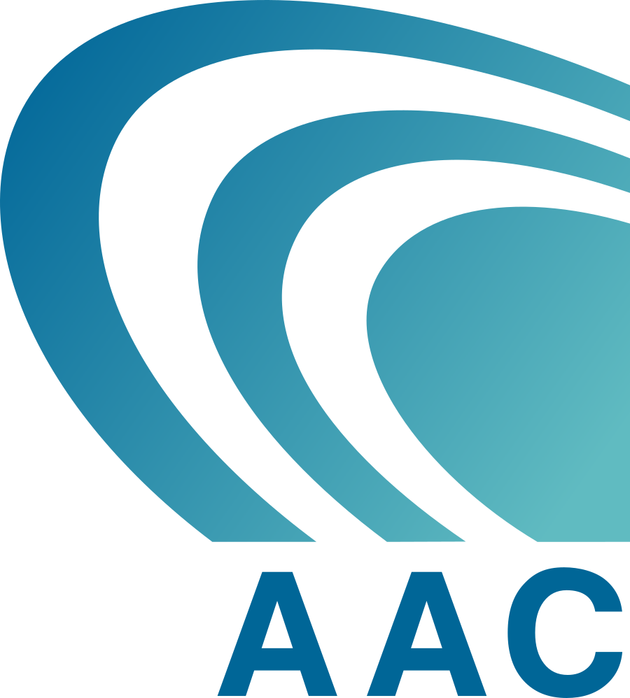</div>

> 图片来源：[Wikipedia](https://en.wikipedia.org/wiki/File:AAC_original_logo.svg)

### OPUS

<div style="display: flex; justify-content: center; align-items: center;"></div>

> 图片来源：[OPUS 官网](https://opus-codec.org/)

完全开放、免版税、多用途的 OGG 格式音频编码器，一般直接通过 ffmpeg 调用。或者可以根据 [OPUS 官网](https://opus-codec.org) 的文档下载与调用 libopus。

---

## 视频滤镜工具

建议直接学习 VCB-S 压制组的教程系列：[vcb-s.nmm-hd.org](https://vcb-s.nmm-hd.org/)

| 工具 | 简介 |
|------|------|
| **[VapourSynth](https://github.com/vapoursynth/vapoursynth/releases)** | 源视频有时带有画面问题，就靠它修复。安装时应注意不同版本对 Python 环境有强绑定。**安装：[vapoursynth.com](https://www.vapoursynth.com/doc/installation.html)** |
| **[AviSynth+](https://github.com/AviSynth/AviSynthPlus/releases)**     | 含多线程优化，添加高位深支持的老款视频处理工具 AviSynth。现已被更先进的 VapourSynth 取代，但还有些滤镜仍是独占。 |
| **[avs2yuv](https://github.com/DJATOM/avs2yuv/releases)**              | 相当于 VapourSynth 中的 VSPipe.exe，使导出 AviSynth 到管道（pipe）变得容易。 |
| **[avs2pipemod](https://github.com/chikuzen/avs2pipemod/releases)**    | 相当于 VapourSynth 中的 VSPipe.exe，使导出 AviSynth 到管道（pipe）变得容易。 |

---

## 视频编码器

**lavf（LibavFormat）**：负责封装/解封装的动态链接库。

**FFMS2（FFmpegSource2）**：负责解码的动态链接库，用于给 x264 内置的 AviSynth 提供解码后的源。

### x264

<div style="display: flex; justify-content: center; align-items: center;"></div>

> 来源：[Wikipedia](https://commons.wikimedia.org/wiki/File:X264.png)

| 来源 | 封装支持 | 特性 |
|------|---------|------|
| **[Patman](https://www.mediafire.com/folder/arv5xmdqyiczc)** | ✅ FFMS2 解码、Lavf 封装              | 8-10bit |
| **[LigH](https://www.mediafire.com/?bxvu1vvld31k1)**         | ✅ FFMS2 解码、Lavf 封装              | 8-10bit |
| **[jspdr (tMod)](https://github.com/jpsdr/x264/releases/)**  | ✅ FFMS2 解码、Lavf 封装              | 8-10bit，MCF 线程管理 |
| **x264 7mod<br>[谷歌盘](https://drive.google.com/drive/folders/1kFCeNGA_wiiLt-DSeI3cyY8vxlffgQcy?usp=sharing)<br>[百度云](https://pan.baidu.com/s/1sbz8WztGTz3lcLzirHW_2w)** | ✅ FFMS2 Lavf 解码与封装 | 8-10bit，hqdn3d 时域降噪 |
| **[Komisar (KMod)](http://komisar.gin.by/)**                 | ✅ FFMS2 解码、Lavf 封装               | 8, 10bit |

> [8-10-12bit] 表示一个可同时支持三种色深的可执行文件；

> [8][10][12]bit 表示三种不同可执行文件版本。  

---

### x265

<div style="display: flex; justify-content: center; align-items: center;"></div>

> 来源：[Wikipedia](https://en.wikipedia.org/wiki/File:X265_%28HEVC_encoder%2C_logo%29.svg)

视频编码器本体不支持额外的解码与封装/解封装功能并非缺陷。视频编码器本身不处理音频流，因此压制视频后，音频流仍需封装。此外，x265、AV1、VVC 等较新编码的未封装格式能够提供帧率、分辨率、色彩格式等全局元数据，因此未封装状态下也可在视频播放器中预览。

| 来源 | 封装支持 | 色深支持 | 特性 |
|------|---------|---------|------|
| **[LigH](http://www.mediafire.com/?6lfp2jlygogwa)**                               | ⛔ 导出 .hevc | 8-10-12bit      | 附 x86 32bit 版，含 libx265.dll |
| **[jpsdr](https://github.com/jpsdr/x265/releases)**                               | ⛔ 导出 .hevc | 8-10-12bit      | GCC 12.2 + MSVC_llvm 1928，支持 aq-mode 5 |
| **[Rigaya](https://drive.google.com/drive/folders/0BzA4dIFteM2dWEpvWGZXV3ZhdTA)** | ⛔ 导出 .hevc | 8-10-12bit      | GCC 9.3，附 32bit 版 |
| **[Patman](https://github.com/Patman86/x265-Mod-by-Patman/releases)**             | ⛔ 导出 .hevc | 8-10-12bit      | GCC 11 + MSVC 1925 |
| **[ShortKatz](https://forum.doom9.org/showthread.php?p=1937773#post1937773)**     | ⛔ 导出 .hevc | 8-10-12bit      | arm64~64e 的 Mac 与安卓平台使用 |
| **[DJATOM-aMod](https://github.com/DJATOM/x265-aMod/releases/)**                  | ⛔ 导出 .hevc | 10bit, 10-12bit | LLVM 的针对 Intel 与 AMD 架构优化版 |
| **[MeteorRain-yuuki](https://down.7086.in/)**                                     | ✅ Lavf 封装    | 8, 10, 12bit    | GCC 9.3 + ICC 1900 + MSVC 1916 |

> 未使用 y4m 或 lavf 时应手动指定 `-D` 参数

---

### SVT-AV1

<div style="display: flex; justify-content: center; align-items: center;"></div>

> 来源：[Wikipedia](https://commons.wikimedia.org/wiki/File:AV1_logo_2018.svg)

编码器由两个文件组成：`SvtAv1Enc.dll`、`SvtAv1EncApp.exe`
- Clang（LLVM）针对当前 PC CPU 架构编译版本的性能最佳，其次是 GCC，再次为 MSVC（Visual Studio）；性能差异最高可达 10%~50%

| 来源 | 封装支持 | 色深支持 | 已编译 | 特性 |
|------|---------|---------|--------|------|
| **[SVT-AV1](https://gitlab.com/AOMediaCodec/SVT-AV1)**                                      | ⛔ 导出 .ivf | 8-10-12bit | ⛔ | 官方版 |
| **[Gitlab Pipelines](https://gitlab.com/AOMediaCodec/SVT-AV1/-/pipelines)**                 | ⛔ 导出 .ivf | 8-10-12bit | ✅ | 官方 CI/CD 版，属于一种 Beta 测试版，但无需编译。找到最新通过的 Daily Run 计划，选择对应系统版本下载 |
| **[SVT-AV1-Essential by nekotrix](https://github.com/nekotrix/SVT-AV1-Essential/releases)** | ⛔ 导出 .ivf | 8-10-12bit | ✅ | 增加了新参数，新功能参数的修改版，目前（3.1）版也与官方版进度一致 |
| **[SVT-AV1-HDR by Patman86](https://github.com/Patman86/SVT-AV1-Mod-by-Patman)**            | ⛔ 导出 .ivf | 8-10-12bit | ⛔ | 增加了 HDR 支持的修改版 |
| **[SVT-AV1-PSY](https://github.com/psy-ex/svt-av1-psy)**                                    | ⛔ 导出 .ivf | 8-10-12bit | ⛔ | 增加了更高画质选项的修改版，目前主要的优化已经合并到了 SVT-AV1 官方版，且已停止开发，版本落后于官方，与官方版一样需要编译 |

---

### Windows 手动编译 SVT-AV1

> 官方指南：[Build Guide](https://gitlab.com/AOMediaCodec/SVT-AV1/-/blob/master/Docs/Build-Guide.md)

1. 安装 **Visual Studio**（2017/2019/2022）并启用 **C++ 桌面开发组件**  
2. 安装 **CMake**：[CMake Releases](https://github.com/Kitware/CMake/releases#gh-md-img-large)
  - <div style="display: flex; justify-content: center; align-items: center; flex-direction: column;">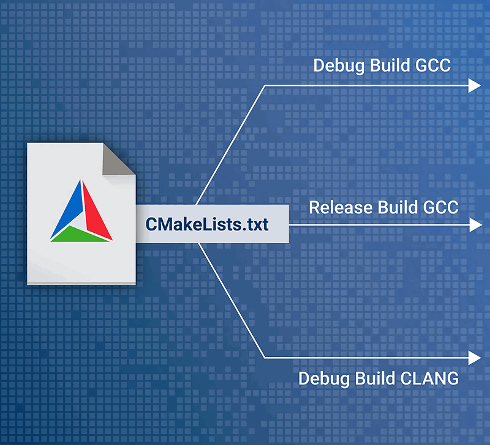</div>
3. 安装 **NASM**：[NASM 官方下载](https://www.nasm.us/pub/nasm/releasebuilds/?C=M;O=D)
  - <div style="display: flex; justify-content: center; align-items: center; flex-direction: column;">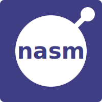</div>
  - 在打开的网盘路径中根据系统和指令集位宽找最新版程序 
    - 例如，Windows 64bit 选择 最新版/win64/nasm-***-installer-x64.exe
  - 安装时可以去勾选 Manual（说明书）和 VS8 Integration（Visual Studio 8 集成）
4. 下载 [SVT-AV1 源代码](https://gitlab.com/AOMediaCodec/SVT-AV1/-/archive/master/SVT-AV1-master.zip) 并运行 `Build/windows/build.bat`  
5. 编译输出位于 `Bin\Debug`，确认可执行文件存在后测试：  
```bash
SvtAv1EncApp.exe -v
```
---

### 使用 Clang（LLVM）编译 SVT-AV1（推荐）

> 所有命令建议在 **CMD 或 (Git) Bash** 中执行，不要使用 PowerShell。

#### 一. 编译环境

<div style="display: flex; justify-content: center; align-items: center; flex-direction: column;"></div>

1. **LLVM（clang 支持）**：[LLVM Releases](https://github.com/llvm/llvm-project/releases/latest)
  - 在打开的网盘路径中根据系统和指令集位宽找最新版程序 
    - 例如，Windows 64bit 操作系统选 LLVM-***-win64.exe
  - 安装时选择 Add LLVM to the system PATH for all/current users
2. **Microsoft C++ Build Tools**：[Microsoft C++ Build Tools](https://visualstudio.microsoft.com/visual-cpp-build-tools)
  - 如果已经安装 Visual Studio，且直接下载了 C++ 桌面应用开发组件，则可以跳过这步
  - 下载并运行安装程序，选择 Desktop development with C++
  - 打开一个记事本，将实际安装位置路径拷贝进去
  - 安装页面中，可以仅选择安装 MSVC 和最新的 Windows 10/11 SDK
3. **CMake**、**NASM**：与上方教程步骤一致
4. Git（可选）：git-scm.com/download/win
5. 编译前确认所有工具正确安装（命令行能正确输出）
```batch
:: 如果安装时选择其它路径，则修改
"C:\Program Files\LLVM\bin\clang.exe" --version
:: clang version ***
:: Target: x86_64-pc-windows-msvc
:: Thread model: posix
:: InstalledDir: C:\Program Files\LLVM\bin

where clang-cl
:: C:\Program Files\LLVM\bin\clang-cl.exe

nasm --v
:: NASM version *** compiled on *** *** ***
cmake --version
:: cmake version ***
:: CMake suite maintained and supported by Kitware (kitware.com/cmake)
```

#### 二. 下载项目源代码

**浏览器下载**

将 GitLab/AOMediaCodec/SVT-AV1 项目 [打包下载](https://gitlab.com/AOMediaCodec/SVT-AV1/-/archive/master/SVT-AV1-master.zip) 并解压

**Git 下载**

若照上面安装了 Git，则打开 Git Bash，并使用下方命令下载：

1. 移动到下载路径（不同的命令行工具路径格式和要求不同）
  - `cd <下载盘>`
2. 下载 SVT-AV1
  - `git clone https://gitlab.com/AOMediaCodec/SVT-AV1.git`
  - `cd svt-av1`

#### 三. 编译项目

**完整命令行列表（仅供参考，无法一次执行）**
```batch
chcp 65001
call "C:\Program Files (x86)\Microsoft Visual Studio\2022\BuildTools\VC\Auxiliary\Build\vcvars64.bat"
set "CC=clang-cl"
set "CXX=clang-cl"

cmake --fresh -B svt_build -G Ninja ^
-DCMAKE_BUILD_TYPE=Release ^
-DBUILD_SHARED_LIBS=OFF ^
-DCMAKE_CXX_FLAGS_RELEASE="-flto /DNDEBUG /clang:-O2 -march=native"
```

1. 切换文本编码到 UTF-8：
```batch
chcp 65001
```
2. 在先前下载的 VS Build Tools 路径中运行 vcvars64.bat 环境配置脚本（根据实际安装位置调整）：
```batch
call "C:\Program Files (x86)\Microsoft Visual Studio\2022\BuildTools\VC\Auxiliary\Build\vcvars64.bat"
```
> 若已经有了“C++ 桌面应用开发组件”的 64bit Visual Studio，则路径可能是：

> `C:\Program Files\Microsoft Visual Studio\2022\Community\VC\Auxiliary\Build\vcvars64.bat`

<div style="display: flex; justify-content: center; align-items: center; flex-direction: column;">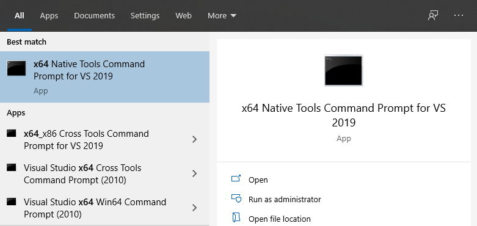</div>

> 图：x64 Native Tools Command Prompt for VS 20xx

3. 运行 vcvars64.bat 后会进入一个新的 CMD 界面，在此指定两个变量以定义使用 Clang-CL 编译器：
```batch
set "CC=clang-cl"
set "CXX=clang-cl"
```
4. 用 CMake 生成 Ninja 项目并配置编译选项（根据压制电脑的 CPU 架构进行调整）：
  - 如果当前目录不在 SVT-AV1 或 SVT-AV1-PSY 目录下，则使用 `cd` 移动过去
  - 如果 CPU 支持 AVX-512，且比 ZEN 2 架构新，则推荐 `-DENABLE_AVX512=ON`
```batch
:: 换行符取决于终端软件，CMD 使用 `^`，Bash 使用 `\`
:: 如果要编译 Debug 版而非发布版，则去掉 `-DCMAKE_BUILD_TYPE=Release` 整行
cmake --fresh -B svt_build -G Ninja ^
-DCMAKE_BUILD_TYPE=Release ^
-DBUILD_SHARED_LIBS=OFF ^
-DENABLE_AVX512=OFF ^
-DSVT_AV1_LTO=OFF ^
-DCMAKE_CXX_FLAGS_RELEASE="-flto /DNDEBUG /clang:-O2 -march=native" ^
-DCMAKE_C_FLAGS_RELEASE="-flto /DNDEBUG /clang:-O2 -march=native"
```
5. 最后使用 Ninja 编译，不用 `-DCMAKE_BUILD_TYPE=Release` 则会输出到 Bin\Debug ）：
```batch
ninja -C svt_build
:: *** warnings generated.
:: D[242/242] Linking C executable *:\***\SVT-AV1-master\Bin\Release\SvtAv1EncApp.exe
```

---

## 编码器官方开源项目

基本上有以下用途：
- 下载并检查、修改、编译源码
- 检查变更提交（Commit）的更新信息
- 向开发者反馈编码器问题（Issues）

| 视频编码器项目                                                                             | 简介                                               |
| ----------------------------------------------------------------------------------- | ------------------------------------------------ |
| **[x264 – VideoLAN](https://code.videolan.org/videolan/x264)**                      | H.264/AVC 编码器，由 VideoLAN 团队维护，广泛用于 FFmpeg、OBS 等。 |
| **[x265 – MulticoreWare](https://bitbucket.org/multicoreware/x265_git/src/master)** | H.265/HEVC 编码器的主要开源实现。                           |
| **[SVT-AV1 – AOMedia](https://gitlab.com/AOMediaCodec/SVT-AV1)**                    | Intel 维护的高性能 AV1 编码器，属于 AOMedia 官方 SVT 系列。       |
| **[libaom – AOMedia](https://aomedia.googlesource.com/aom/)**                       | AOMedia 官方 AV1 编码器参考实现（质量优先）。                    |
| **[rav1e – Xiph / Mozilla](https://github.com/xiph/rav1e)**                         | 用 Rust 编写的 AV1 编码器，专注安全与速度。                      |
| **[vpx – WebM / Google](https://chromium.googlesource.com/webm/libvpx/)**           | Google 的 VP8/VP9 官方实现。                           |
| **[SVT-HEVC – Intel](https://github.com/OpenVisualCloud/SVT-HEVC)**                 | Intel 的高性能 HEVC 编码器（面向服务器/云转码）。                  |
| **[SVT-VP9 – Intel](https://github.com/OpenVisualCloud/SVT-VP9)**                   | Intel 的 VP9 编码器实现。                               |
| **[openh264 – Cisco](https://github.com/cisco/openh264)**                           | Cisco 开源的 H.264 编码器，轻量级且广泛用于实时通信。                |
| **[Theora – Xiph.Org](https://gitlab.xiph.org/xiph/theora)**                        | 基于 VP3 的开放视频编码标准。                                |
| **[FFmpeg – FFmpeg.org](https://github.com/FFmpeg/FFmpeg)**                         | 虽非单独编码器，但整合了 x264、x265、libaom、SVT 等众多编码器。        |
| **[Daala – Xiph.Org](https://gitlab.xiph.org/xiph/daala)**                          | Xiph 的实验性下一代视频编码器（为 AV1 提供技术基础）。                 |
| **[VVenC – Fraunhofer HHI](https://github.com/fraunhoferhhi/vvenc)**                | Fraunhofer HHI 的 VVC (H.266) 开源编码器。              |
| **[VVC Test Model (VTM)](https://vcgit.hhi.fraunhofer.de/jvet/VVCSoftware_VTM)**    | JVET 官方 VVC/H.266 参考软件实现。                        |


| 音频编码器项目                                                                  | 简介                                                     |
| ------------------------------------------------------------------------ | ------------------------------------------------------ |
| **[QAAC – nu774](https://github.com/nu774/qaac)**                        | 基于 Apple CoreAudio 的 AAC 编码器前端（Windows 上需 iTunes DLL）。 |
| **[Opus – Xiph / Mozilla / Skype](https://gitlab.xiph.org/xiph/opus)**   | IETF 标准化的低延迟音频编码器，适用于语音与音乐。                            |
| **[libopusenc – Xiph.Org](https://gitlab.xiph.org/xiph/libopusenc)**     | 封装 Opus 编码 API 的简易库，用于录音或实时流。                          |
| **[FDK-AAC – Fraunhofer IIS](https://github.com/mstorsjo/fdk-aac)**      | Fraunhofer 官方开源 AAC 编码器（高质量 LC/HE/HEv2 模式）。            |
| **[LAME – HydrogenAudio](https://lame.sourceforge.io/)**                 | 著名的开源 MP3 编码器。                                         |
| **[FLAC – Xiph.Org](https://gitlab.xiph.org/xiph/flac)**                 | 无损音频压缩格式 FLAC 的官方实现。                                   |
| **[Vorbis – Xiph.Org](https://gitlab.xiph.org/xiph/vorbis)**             | Xiph.Org 的有损音频编码器，开源替代 MP3。                            |
| **[Musepack (MPC)](https://github.com/MusepackProject/musepack)**        | 专注高比特率透明音质的音频编码器。                                      |
| **[WavPack](https://github.com/dbry/WavPack)**                           | 无损/有损混合音频编码器。                                          |
| **[ALAC – Apple](https://github.com/macosforge/alac)**                   | Apple 无损音频编解码器（ALAC）的开源实现。                             |
| **[TTA – True Audio](http://true-audio.com/)**                           | 无损音频编码格式 TTA 的官方实现。                                    |
| **[Monkey’s Audio (APE)](https://github.com/monkeysaudio/Monkey-Audio)** | 高压缩率的无损音频编码器。                                          |
| **[Shorten – SoftSound](https://github.com/robdobsn/shorten)**           | 早期无损音频格式（FLAC 的前身之一）。                                  |

---

## 参考

SVT-AV1 CLang LLVM 编译的原教程位于 [Discord/AV1 weeb edition/scripts-tools-and-guides](https://discord.com/channels/992019264959676448/1253334764920766505)，本教程进行了本地化（如修改 set 命令、添加 chcp 命令），以及额外说明（如 Visual Studio 已经安装的 vcvars），额外引导（下载具体版本），以及额外的检查（LLVM、NASM、CMAKE 是否正确安装）等改进。